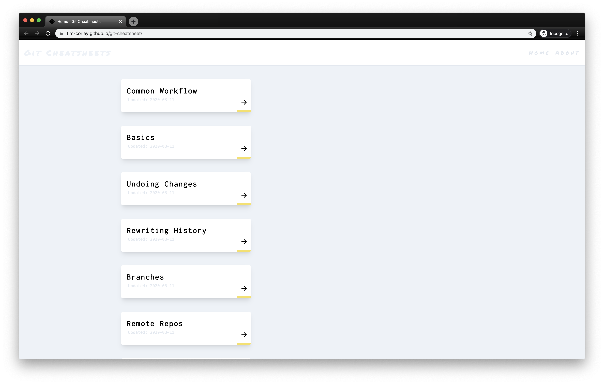

  

<h1 align="center">
  GIT CHEATSHEETS
</h1>

### 🧐 About

Use this site to view references, notes, and examples for common git commands & workflows.

### 🛠 Built With

- **[Gatsby](https://www.gatsbyjs.org/)**

- **[TailwindCSS](https://tailwindcss.com/)**
